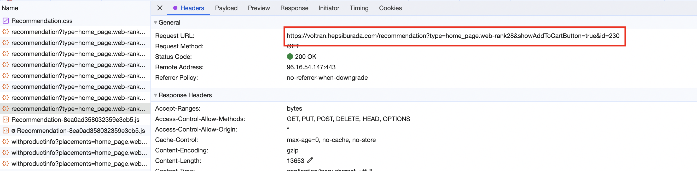
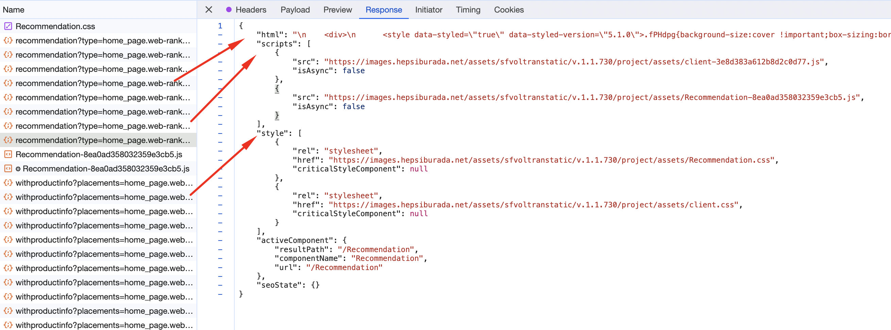
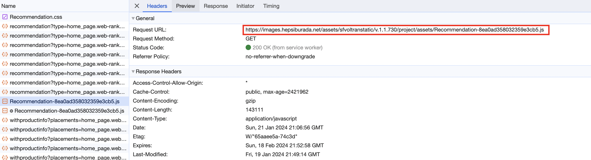
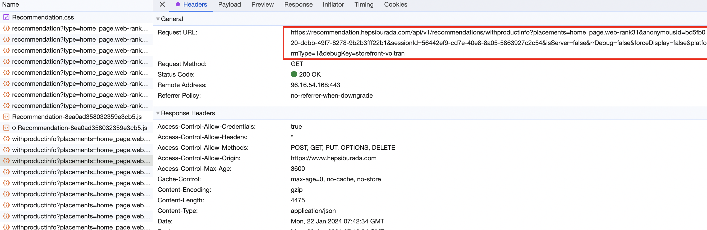
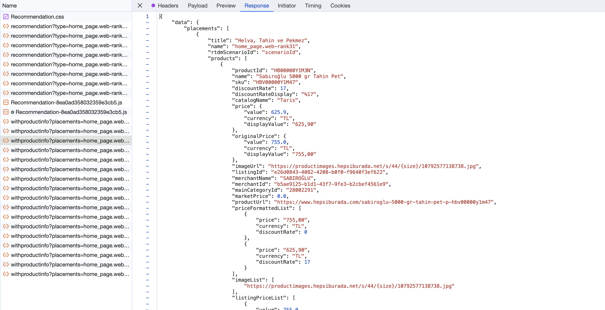

### hepsiburada.com analysis

According to console request/response overview, i've come up with the following conclusion:

1. **Initial Request for Recommendations**:
   

- **URL example
  **: `https://voltran.hepsiburada.com/recommendation?type=home_page.web-rank28&showAddToCartButton=true&id=230`
- **Function**: This request is targeted at fetching a basic structure or placeholder for product recommendations for a
  specific section of the homepage. The parameters (`type`, `showAddToCartButton`, and `id`) indicate the customization
  and tracking features for the recommendations.
- **Response**: It returns an HTML structure, styles, and scripts that are crucial for the visual representation of the
  recommendations on the website.
  

2. **Static JavaScript File for Dynamic Rendering and Logic**:
   
- **URL example
  **: `https://images.hepsiburada.net/assets/sfvoltranstatic/v.1.1.730/project/assets/Recommendation-8ea0ad358032359e3cb5.js`
- **Role**: This file is crucial for the client-side logic. It manages the rendering of recommendations, handles user
  interactions, and possibly sends data back to the server for tracking user behavior or for further personalization of
  recommendations.
- **Details**: The JavaScript file likely contains functions for dynamically updating content based on user actions or
  server responses. It is responsible for making the recommendation section interactive and responsive to user inputs.

3. **API Call for Detailed Product Information**:
   
- **URL example
  **: `https://recommendation.hepsiburada.com/api/v1/recommendations/withproductinfo?placements=home_page.web-rank31&anonymousId=bd5fb020-dcbb-49f7-8278-9b2b3fff22b1&sessionId=56442ef9-cd7e-40e8-8a05-5863927c2c54&isServer=false&rrDebug=false&forceDisplay=false&platformType=1&debugKey=storefront-voltran`
- **Purpose**: This call is designed to retrieve detailed information about the products being recommended. This
  includes comprehensive data like product names, prices, images, merchant details, and customer reviews.
- **Details**: This detailed data is critical for rendering a rich and engaging recommendation section on the website.
  

**Summary of the Recommendation Rule**: The rule for listing and showing products to the user seems to be a combination
of predefined placement types (e.g., `home_page.web-rank28`), user/session-based customization (through anonymousId and
sessionId), and dynamic content rendering based on user interaction and detailed product information. The system likely
uses these parameters to tailor the recommendations to the user's browsing context and preferences. The initial request
sets up the recommendation section, the JavaScript file handles the dynamic aspects and user interactions, and the
detailed API call enriches the section with comprehensive product data.

In essence, the recommendation system is designed to provide a personalized and interactive user experience, driven by a
combination of static web structures, dynamic client-side scripting, and detailed server-side data retrieval.